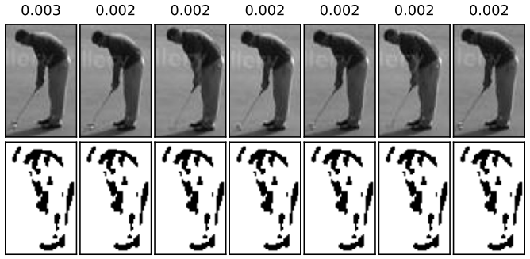
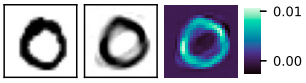
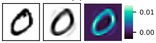

# GRLGQ: Generalized Relevance Learning Grassmann Manifold

Welcome to the repository for GRLGQ  [Generalized Relevance Learning Grassmann Manifold](https://arxiv.org/abs/2403.09183)!

## What is GRLGQ?

GRLGQ is a novel approach to image set classification, offering intrinsic interpretability. It treats each image set as a point on the Grassmann manifold, representing the set with a subspace derived through Singular Value Decomposition (SVD). During training, GRLGQ learns a collection of subspace prototypes and relevance factors. These prototypes capture typical behaviours within classes, while the relevance factors identify the most discriminative principal vectors or images crucial for the classification task.

## Prerequisites

#### General

- Python 3
- PyTorch >= 1.5 and <= 1.7!
- Optional: CUDA

#### Required Python Packages:

- numpy
- pandas
- opencv
- tqdm
- scipy
- matplotlib

## Implementation Options:

In this repository, we offer two distinct implementations of the GRLGQ method:

### Python Class Implementation:

This implementation utilizes a Python class to create the model. It operates independently of PyTorch, simplifying the setup process. If you prefer a lightweight solution without dependencies on external frameworks, this option is suitable for you.

### PyTorch Model Class Implementation:

Alternatively, we provide an implementation that leverages PyTorch to create a model class. This implementation offers additional functionalities and integration with the PyTorch ecosystem. If you require advanced features or plan to integrate the model into existing PyTorch workflows, we recommend using this implementation.

Please select the implementation that best suits your requirements. Both options are provided to accommodate a variety of use cases and preferences.


## Training a ProtoTree

First, you need to create a folder `./runs`.

The GRLGQ can be trained by running `training.py` with arguments.

An example for ETH-80: 

```bash
training.py --nepochs 500 --log_dir ./runs/prototypes --dataset ETH-80 --dim_of_subspace 10 --num_of_protos 1 --lr_protos 0.01 --lr_rel 0.0001 --batch_size_train 1 --cost_fun identity --milestones 100,200,300,400,500
```

To speed up the training process, the number of workers of the DataLoaders can be increased by setting num_workers to a positive integer value (a suitable number depends on your available memory).

### Monitoring Training Progress:

To keep track of the training progress, please check the `--log_dir`. This directory contains several essential files:

- `log_epoch_overview.csv`: This file provides a comprehensive overview of each epoch, including the test accuracy, mean training accuracy, and the mean loss.
- `log_train_epochs_losses.csv`: Here, you'll find detailed information about the loss value and training accuracy for each batch iteration.
- `log.txt`: Additional information is logged in this file to aid in monitoring and troubleshooting.


# Explainability


### image-set classification





### image classification


  



## Reference:

When citing our work, please refer to the following article:

`
@article{mohammadi2024generalized,
  title={Generalized Relevance Learning Grassmann Quantization},
  author={Mohammadi, M and Babai, M and Wilkinson, MHF},
  journal={arXiv preprint arXiv:2403.09183},
  year={2024}
}
`

Please use this article as the primary reference for our methodology and approach. If you need further details or clarification, don't hesitate to reach out.

